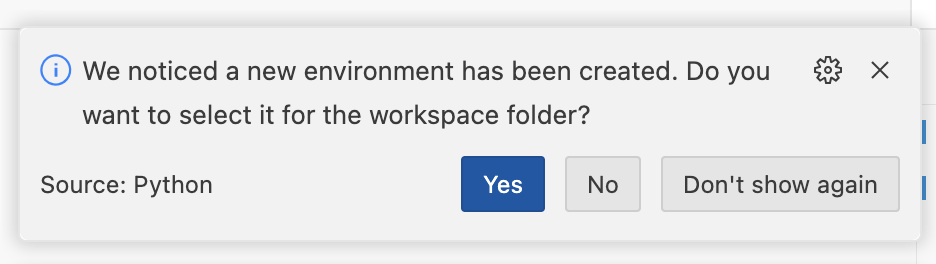
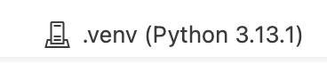

# Spread Convergence

Not a finished project - just setting up a simple backtesting framework where the indices and tickers are easily changeable.
Ideally the project should speed up the screening process.

## Setup

1. Make sure you have [uv installed](https://docs.astral.sh/uv/getting-started/installation).
2. Make sure you have recommended vscode addons installed.
3. Run `uv run` in the root directory of the project. This will automatically create a complete python environment with all the dependencies installed.
4. Select it as the interpreter in vscode.

   

5. Open the ´spread_convergence.py´-notebook and select the same interpreter as the kernel in the top right corner.

   

6. Run the notebook.
